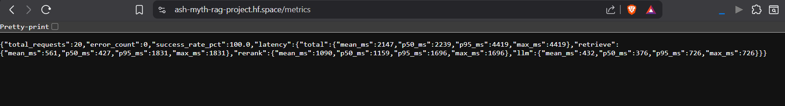

# Hindi ML Course Teaching Assistant

A cross-lingual RAG system built over 38 Hindi machine learning lectures by Krish Naik. Ask questions in English, get answers grounded in Hindi video content — with exact video and timestamp citations.

Most RAG projects are PDF-to-chatbot wrappers. This one works with audio/video: transcribing Hindi lectures with Whisper, chunking with timestamps, building semantic search over spoken content, and serving it through a production-grade API with MLOps instrumentation.

**Frontend:** [ash-myth.github.io/ml-course-assistant](https://ash-myth.github.io/ml-course-assistant)  
**API:** [ash-myth-rag-project.hf.space](https://ash-myth-rag-project.hf.space)

---

## Architecture

```
Hindi Audio (MP3)
      │
      ▼
Whisper medium          ← transcribes + translates Hindi → English
      │
      ▼
Timestamped Chunks      ← 17,619 chunks across 38 videos
      │
      ▼
all-MiniLM-L6-v2        ← sentence embeddings (384D)
      │
      ▼
FAISS IndexFlatIP       ← vector store, cosine similarity search
      │
      ▼
CrossEncoder reranker   ← ms-marco-MiniLM-L-6-v2, top-20 → top-3
      │
      ▼
Context expansion       ← ±20s window around each retrieved chunk
      │
      ▼
Groq (llama-3.1-8b)     ← generates answer with video + timestamp citations
      │
      ▼
FastAPI + LangSmith     ← REST API with tracing and latency metrics
```

---

## What Makes This Different

**Cross-lingual retrieval** — source content is Hindi audio. Whisper translates during transcription so retrieval and generation happen entirely in English without losing the original lecture content.

**Retrieve-then-rerank** — FAISS retrieves 20 candidates, a cross-encoder reranks to 3. This two-stage approach is standard in production RAG systems and significantly improves precision over naive top-k retrieval.

**Timestamp-aware chunking** — every chunk carries its video number and timestamp. Retrieved context expands ±20 seconds around each hit before being passed to the LLM, giving it a coherent paragraph instead of isolated sentence fragments.

**MLOps instrumentation** — every pipeline run is traced in LangSmith with per-stage latency (retrieve, rerank, LLM). A `/metrics` endpoint exposes p50/p95 latency stats across all requests.

---

## Evaluation

Retrieval quality measured on 20 manually curated queries against ground-truth video labels.

| Metric | Score |
|---|---|
| Hit@3 | 80% (16/20) |
| Eval CI | GitHub Actions — runs on every push |

---

## Stack

| Layer | Technology |
|---|---|
| Transcription | OpenAI Whisper (medium) |
| Embeddings | sentence-transformers/all-MiniLM-L6-v2 |
| Vector Store | FAISS (IndexFlatIP) |
| Reranker | cross-encoder/ms-marco-MiniLM-L-6-v2 |
| LLM | Groq API — llama-3.1-8b-instant |
| API | FastAPI + Uvicorn |
| Tracing | LangSmith |
| Container | Docker + Docker Compose |

---

## Dataset

[Krish Naik Hindi ML Playlist](https://www.youtube.com/playlist?list=PLTDARY42LDV7WGmlzZtY-w9pemyPrKNUZ) — 38 lectures covering linear regression, logistic regression, SVM, decision trees, random forests, ensemble methods, cross validation, performance metrics, EDA, clustering, and more.

---

## Project Structure

```
ml-course-assistant/
├── create_chunks.py     # Whisper transcription + translation
├── embed_chunks.py      # Sentence embeddings + FAISS index
├── retrieve.py          # FAISS retrieval
├── rerank.py            # Cross-encoder reranking
├── answer.py            # Context expansion + LLM call + LangSmith tracing
├── app.py               # FastAPI server with metrics
├── index.html           # Frontend — chat UI with YouTube timestamp links
├── eval/
│   ├── questions.json   # 20 ground-truth eval queries
│   └── eval.py          # Hit@3 evaluation harness
├── Dockerfile
├── docker-compose.yml
├── requirements.txt
└── .env
```

---

## Setup

### Prerequisites
- Python 3.10+
- Docker
- Groq API key — [console.groq.com](https://console.groq.com)
- LangSmith API key — [smith.langchain.com](https://smith.langchain.com) (optional, for tracing)

### 1. Clone

```bash
git clone https://github.com/ash-myth/ml-course-assistant
cd ml-course-assistant
```

### 2. Environment

Create `.env`:

```
GROQ_API_KEY=your_groq_key
LANGCHAIN_API_KEY=your_langsmith_key
LANGCHAIN_TRACING_V2=true
LANGCHAIN_PROJECT=krish-naik-rag
```

### 3. Build the index

Download the playlist and transcribe (one-time, runs overnight):

```bash
pip install yt-dlp openai-whisper
yt-dlp -x --audio-format mp3 -o "audios/%(playlist_index)02d_%(title)s.%(ext)s" "https://www.youtube.com/playlist?list=PLTDARY42LDV7WGmlzZtY-w9pemyPrKNUZ"
python create_chunks.py
python embed_chunks.py
```

### 4. Run with Docker

```bash
docker compose up --build
```

API runs at `http://localhost:7860`. Open `index.html` in your browser.

### 5. Run without Docker

```bash
pip install -r requirements.txt
uvicorn app:app --reload
```

---

## API

| Method | Endpoint | Description |
|---|---|---|
| GET | `/health` | Health check |
| GET | `/metrics` | p50/p95 latency stats, error rate |
| POST | `/ask` | RAG query |

### Example

```bash
curl -X POST http://localhost:7860/ask \
  -H "Content-Type: application/json" \
  -d '{"question": "what is precision and recall"}'
```

```json
{
  "answer": "Precision is the ratio of true positives to true positives plus false positives...",
  "sources": [
    {
      "title": "Performance Metrics, Accuracy, Precision, Recall...",
      "number": "14",
      "timestamp": "19m02s",
      "text": "..."
    }
  ],
  "latency": {
    "retrieve_ms": 41,
    "rerank_ms": 93,
    "llm_ms": 707,
    "total_ms": 839
  }
}
```
## Screenshots

### LangSmith Trace


### Metrics API


### Frontend

---
## Design Decisions
k=10 for retrieval — initially set to 20 to improve recall during 
position bias experiments. Reverted to 10 after metrics showed rerank 
was the bottleneck (p50 719ms) with no measurable quality gain from 
higher k.

---
## Built by [Ashmit Chatterjee](https://github.com/ash-myth)
